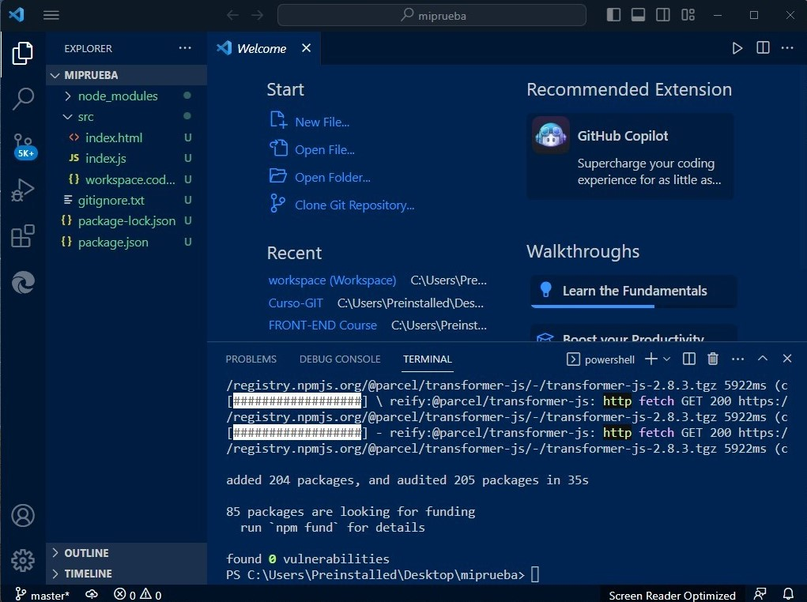

# Laboratorio de GIT

## Archivo README.md con la descripción de lo qué se ha realizado en el mi primero laboratorio

El primer paso fue instalar GIT en mi ordenador descargándolo [aquí]("https://git-scm.com/downloads") y crearme una cuenta en GitHub [aqui]("https://github.com").
Despues instalar en mi ordenador Visual Studio Code (VSC) descargado [aqui](https://code.visualstudio.com/download).

* En VSC, abro el terminal y voy a crear una carpeta con el nome del repositorio "MIPRUEBA" en el directorio que prefiero y alli copio el proyecto descargado, como se puede ver en esta imagen:

Ingreso en la carpeta que acabo de crear y voy a executar lso comandos:*"npm install"*y*"npm start"*para instalar las dependencias del projecto y executarlo:
.
Inicializo el repositorio de GIT con el comando*"Git init"*.

 Ahora se puede empezar a trabajar.

En el file HTML voy a insertar el titulo en el tag <*title*>  **"TITULO PRUEBA DE LABORATORIO GIT"**, crear el titulo <*H1*> **Mi primero laboratorio de GIT** y ensertar un parafo <*p*> con **"Lorem ipsum"**.

* Despues he creado en mi account GitHub un nuevo repositorio.
Copio el link de el repositorio que acabo de crear y lo voy a pegar en el terminal de VSC con el comando: *"Git remote add origin* + *link repositorio*"
Ahora que lo hemos añadido.
Volvemos ahora a el nuestro projecto en VSC:
guardamos el archivo y anadimos el archivo al staging listo para guardarlo en remoto con el comando: *"Git add ."* y seguendo vamos a ensertar el comando: *Git commit -m"ensertadao parafo"* para esplicar las modificaciones que hemos hecho.
Subimos el projecto en el repositorio GitHub,subendo la rama local que tenemos al repo con el comando: *"Git push origin master"*.

* Vamos aqui a crear  otra rama para hacer modificaciones en el desarollo del projecto sin compromitir el projecto principal.
He creado otra rama llamada "development" con el comando :*"Git checkout -b development*.
 Entonces en la nueva rama he modificado el projecto ensertando un subtitulo con enscrito: **"modifica en la rama develope"**.
 Voy e repetir los comandos *"Git add .*" y *"git commit -m"Enserto de titulo h2 en la rama development"*.
 Cargo el contenido de la rama *"development"* en remoto ("Git push origin development").
 * Vuelvo a la rama principal "master" y alli voy ad ensertar el comando: *"Git merge development"* para llevar el contenido modificado de la rama "development" en la rama "master".
En ultimo ago un control general con el comando: *"Git status"*, y executo los comandos: *"Git add ."* y *"Git push origin master"* para subir el contenido y modificaciones en GitHub.
